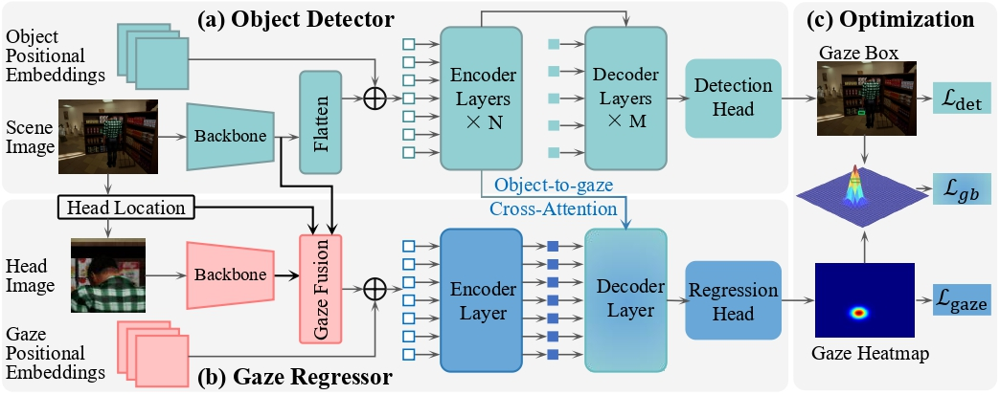

## TransGOP: Transformer-based Gaze Object Prediction
This repository is the official implementation of TransGOP, which studies the gaze object prediction task.
In this work, we introduces Transformer into the fields of gaze object prediction and proposes an end-to-end Transformer-based gaze object prediction method named TransGOP. Specifically, TransGOP uses of-the-shelf Transformer-based object detector to detect the location of objects, and fed the fused feature of the head image and scene image into a Transformer-based gaze prediction branch to regress the gaze heatmap. Moreover, to better enhance the gaze regressor by the informative knowledge from the object detectors, we propose an object-to-gaze attention mechanism to let the queries in the gaze regressor receive the encoded features of the object detector. Finally, to make the whole framework can be end-to-end trained, we propose a Gaze Box loss to jointly optimize the object detector and gaze regressor by enhancing the gaze energy in the box of the stared object. Extensive experiments on the GOO-Synth and GOO-Real datasets demonstrate that our TransGOP achieves state-of-the-art performance on all tracks, i.e. , object detection, gaze estimation, and gaze object prediction.


## Data Preparation
The GOO dataset contains two subsets: GOO-Sync and GOO-Real. 

You can download GOO-synth from the following links:

Train:
[part0](https://zenodo.org/record/5501686/files/goosynth_train.zip?download=1), [part1](https://zenodo.org/record/5501754/files/goosynth_train.z01?download=1), [part2](https://zenodo.org/record/5501788/files/goosynth_train.z02?download=1), [part3](https://zenodo.org/record/5501941/files/goosynth_train.z03?download=1), [part4](https://zenodo.org/record/5502388/files/goosynth_train.z04?download=1), [part5](https://zenodo.org/record/5504008/files/goosynth_train.z05?download=1), [part6](https://zenodo.org/record/5507589/files/goosynth_train.z06?download=1), [part7](https://zenodo.org/record/5511063/files/goosynth_train.z07?download=1), [part8](https://zenodo.org/record/5511688/files/goosynth_train.z08?download=1), [part9](https://zenodo.org/record/5512157/files/goosynth_train.z09?download=1)

Test:
[GOOSynth-Test](https://pan.baidu.com/s/1fhHgXIN5W6VSll7DTO0F4w) (code:hxv9)

Annotation file:

[goosynth_train_v2_no_segm](https://pan.baidu.com/s/1A38TTOQ-ESc8OtqFETLVQQ) (code:9rn2)

[goosynth_test_v2_no_segm](https://pan.baidu.com/s/1AYtPkw9mCLfHb8vp1Dd2mg) (code:tuvn)

You can also download GOO-synth from OneDrive:

Train:
[part1](https://mailnwpueducn-my.sharepoint.com/:u:/g/personal/yangle_nwpu_mail_nwpu_edu_cn/ESk3KTXgDSFMmVcBW_EMAssBvxBf-eBSMK39g8yqFlRVgA?e=dSIXsd),
[part2](https://mailnwpueducn-my.sharepoint.com/:u:/g/personal/yangle_nwpu_mail_nwpu_edu_cn/EVoQzdFRQ85Bok0tmVpPLLcBk-adZBEcuRa-xp20sxVICw?e=hq5bwi),
[part3](https://mailnwpueducn-my.sharepoint.com/:u:/g/personal/yangle_nwpu_mail_nwpu_edu_cn/EUHIrsNLq_pHm2s7E8V9O5IBWBmvf5qI9jFue7wYOVNhyw?e=GYbTaW),
[part4](https://mailnwpueducn-my.sharepoint.com/:u:/g/personal/yangle_nwpu_mail_nwpu_edu_cn/EVTOQM6kkFJJm5v_h7K8r88BF2RlXa76DfE88v3rJkw70Q?e=NPuBzO),
[part5](https://mailnwpueducn-my.sharepoint.com/:u:/g/personal/yangle_nwpu_mail_nwpu_edu_cn/ESLLYmaimxlIgCW4Hy_Q9LMBrMS6ouPsAwWDYf7kUStElA?e=bKvZYd),
[part6](https://mailnwpueducn-my.sharepoint.com/:u:/g/personal/yangle_nwpu_mail_nwpu_edu_cn/ETevP-Nko6BAjBTidy-YsIYB8_145u7SeISKYtIr4AqKVg?e=0o9GOq),
[part7](https://mailnwpueducn-my.sharepoint.com/:u:/g/personal/yangle_nwpu_mail_nwpu_edu_cn/EUhglUujYbFIqYEOSgp5R5kBVZqvz0a4GdGogqlXXm1JAA?e=30ysd6),
[part8](https://mailnwpueducn-my.sharepoint.com/:u:/g/personal/yangle_nwpu_mail_nwpu_edu_cn/EY5AI0TLdrtMkN_pqV3FOzABtSPlnDOcjNT7QMEtDC5iXg?e=zI13Cp),
[part9](https://mailnwpueducn-my.sharepoint.com/:u:/g/personal/yangle_nwpu_mail_nwpu_edu_cn/EXHwQT0GRStFqSML6s8uW6kBLuFF8VjTf_opBg_ivtbUBQ?e=e0Agrv),
[part10](https://mailnwpueducn-my.sharepoint.com/:u:/g/personal/yangle_nwpu_mail_nwpu_edu_cn/EZ1LC_GF9a9EtUnofjLUtW4Bhb_-dg2bSgx6UYGS1piLrA?e=yawdDf),
[part11](https://mailnwpueducn-my.sharepoint.com/:u:/g/personal/yangle_nwpu_mail_nwpu_edu_cn/ERLtx5hBM5tLtUPAjs2yvYgBQ8CrEW4S8zd9HKzow7jX2w?e=BTCvl6)


Test:
[GOOsynth-test_data](https://mailnwpueducn-my.sharepoint.com/:u:/g/personal/yangle_nwpu_mail_nwpu_edu_cn/EQ5DC43-aYVOt3-Jmy5ZIscBFd0yGvVeyiWOoHLFwZsJ4Q)

Annotation file:

[GOOsynth-train_data_Annotation](https://mailnwpueducn-my.sharepoint.com/:u:/g/personal/yangle_nwpu_mail_nwpu_edu_cn/ET6h-STtBiVIn7jpwOP8bzEB__u-FEmwT8wXLKtTUw865g)

[GOOsynth-test_data_Annotation](https://mailnwpueducn-my.sharepoint.com/:u:/g/personal/yangle_nwpu_mail_nwpu_edu_cn/EW3HgRNFGPVHmaoYeFwhY1gB8UxwdEWSr55UwDaxwYvp1w)

You can download GOO-Real from Baidu Netdisk:

Train:
[GOOreal-train_data](https://pan.baidu.com/s/1kSiOW2mvJ7m7Rh-MW3H8KA?pwd=6j5l)(code:6j5l)

Test:
[GOOreal-test_data](https://pan.baidu.com/s/1rzBja86SjmYKJjSOFbKKHA?pwd=aa4i)(code:aa4i)

Annotation file:

[GOOreal-train_data_Annotation](https://pan.baidu.com/s/1RGV5RX8Hq4rAUp4f8asM8A?pwd=xdvm)(code:xdvm)

[GOOreal-test_data_Annotation](https://pan.baidu.com/s/1atpkeLhNK6X6yXUUa9Otag?pwd=a76s)(code:a76s)

You can also download GOO-Real from OneDrive:

Train:
[GOOreal-train_data](https://mailnwpueducn-my.sharepoint.com/:u:/g/personal/yangle_nwpu_mail_nwpu_edu_cn/ETjRM4To-QxNtp9a4hMTTVwBAfBJ8e6Hs7TNv5RzsJgj2w)

Test:
[GOOreal-test_data](https://mailnwpueducn-my.sharepoint.com/:u:/g/personal/yangle_nwpu_mail_nwpu_edu_cn/EXlBBBnd2khPk7S0_FKKGtQBCoIKoHSu7SmpdpxTAICpdw)

Annotation file:

[GOOreal-train_data_Annotation](https://mailnwpueducn-my.sharepoint.com/:u:/g/personal/yangle_nwpu_mail_nwpu_edu_cn/EZEpAPUtWSlGoS7DOwuV1G8BvhYuWZL_NLwqkDJe3sZ7JQ)

[GOOreal-test_data_Annotation](https://mailnwpueducn-my.sharepoint.com/:u:/g/personal/yangle_nwpu_mail_nwpu_edu_cn/EfCtqSoZxnxEgPKwB_IfmfcBvap1R8d3o8wjxUY6tPr0fw)

~~~~
Please ensure the data structure is as below

├── Datasets
   └── goosynth
       └── annotations
          ├── gop_train.json
          ├── gop_val.json
       └── val
          ├── 0.png
          ├── 1.png
          ├── ...
       └── train
          ├── 0.png
          ├── 1.png
          ├── ...
   └── gooreal
        └── annotations
          ├── gop_train.json
          ├── gop_val.json
        └── val
          ├── 0.png
          ├── 1.png
          ├── ...
        └── train
          ├── 0.png
          ├── 1.png
          ├── ...
~~~~

##Environment Preparation
Requirements

```
conda env create -n TransGOP -f environment.yaml
```

##Compiling CUDA operators
   ```sh
   cd models/dino/ops
   python setup.py build install
   ```

## Training & Inference

To carry out experiments on the GOO dataset, please follow these commands:

Experiments on GOO-Synth:
```sh
bash scripts/TransGOP_train.sh /Dateses/goosynth/
```
Experiments on GOO-Real:
```sh
bash scripts/TransGOP_train.sh /Dateses/gooreal/
```

## Pre-trained Models
You can download pretrained models from baiduyun

[Pre-trained Models](https://pan.baidu.com/s/1KxVGSS8MXhEwyEH5wAPPsw) (code:xfyk). 

## Get_Result
Test on the GOO-Synth:

  ```sh
  bash scripts/TransGOP_eval.sh /Dateses/goosynth/ /path/to/your/checkpoint
  ```
Test on the GOO-Real:

  ```sh
  bash scripts/TransGOP_eval.sh /Dateses/gooreal/ /path/to/your/checkpoint
  ```

## Results

Our model achieves the following performance on GOOSynth dataset:

|  AUC  | Dist. | Ang.  |  AP  | AP50 | AP75 | Gaze object prediction mSoC (%) |
| :---: | :---: | :---: | :--: | :--: | :--: | :-----------------------------: |
| 0.963 | 0.079 | 13.30 | 87.6 | 99.0 | 97.3 |              92.8               |

